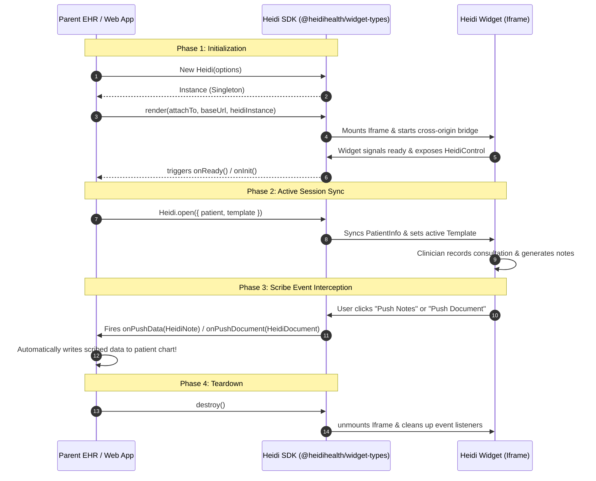

# @heidihealth/widget-types

[](https://www.npmjs.com/package/@heidihealth/widget-types)
[](https://www.typescriptlang.org/)
[](https://opensource.org/licenses/Apache-2.0)

Official TypeScript type definitions and control SDK interfaces for integrating the **Heidi Health Web Widget** into Electronic Health Record (EHR) systems, Practice Management Software (PMS), and other web-based clinical environments.

This package provides a standardized, type-safe API to embed Heidi’s AI scribe directly into your application, manage scribe session states, sync patient contexts, receive live transcriptions, and seamlessly ingest completed medical notes and clinical documents.

---

## 🏗️ Core Architecture & Flow

The integration uses a secure cross-document message bridge between your parent application and the embedded Heidi iframe. The SDK manages this bridge, abstracting postMessage calls into standard JavaScript classes, methods, and typed events.



---

## 📦 Installation

Install the package into your web project using your preferred package manager:

```bash
# npm
npm install @heidihealth/widget-types

# yarn
yarn add @heidihealth/widget-types

# pnpm
pnpm add @heidihealth/widget-types
```

---

## 🚀 Quick Start Guide

Follow these 4 steps to get a basic integration running.

### Step 1: Initialize the Heidi SDK
Create a `Heidi` instance with your desired configuration. This registers your credentials, theme preferences, and behavior hooks.

```typescript
import { Heidi } from '@heidihealth/widget-types';

const heidiInstance = new Heidi({
  token: 'YOUR_HEIDI_JWT_TOKEN', // Heidi authentication token
  theme: 'new', // 'light' | 'dark' | 'new'
  display: {
    position: 'bottom-right',
    draggable: true,
    expandable: true,
    fitToWindow: false,
  },
  onReady: () => {
    console.log('Heidi Web Widget is ready for interaction!');
  },
});
```

### Step 2: Render the Widget
Mount the iframe into your page DOM using the helper functions exported from the frame module.

```typescript
import { render } from '@heidihealth/widget-types/frame';

const mountTarget = document.getElementById('heidi-widget-container');
const baseUrl = 'https://widget.heidihealth.com'; // Heidi widget origin

// Mount the iframe into the target container
const iframeElement = await render(mountTarget, baseUrl, heidiInstance);
```

### Step 3: Open a Session with Patient Context
When a practitioner selects a patient and begins a consultation, open the widget programmatically and pass the patient details.

```typescript
import { HeidiController } from '@heidihealth/widget-types';

// Sync patient context and open the widget
HeidiController.open({
  patient: {
    id: 'pat_987213',
    name: 'Jane Doe',
    gender: 'female',
    dob: '1985-04-12',
  },
  startNewSession: true, // Forces a clean recording workspace
});
```

### Step 4: Handle Pushed Notes & Documents
Listen to user-triggered "Push" events inside the widget to capture the AI-generated note or clinical document and auto-save it into your EHR.

```typescript
// Capture structured medical notes (e.g., SOAP note)
HeidiController.onPushData((note) => {
  console.log('Ingesting structured clinical note for Session:', note.sessionId);
  console.log('Markdown Content:', note.noteData);
  
  // Custom logic to write directly to your database / EHR EHR text area
  myEhrTextArea.value = typeof note.noteData === 'string' ? note.noteData : note.noteData.template;
});

// Capture specialized clinical documents (e.g., Referral letters, Patient Handouts)
HeidiController.onPushDocument((doc) => {
  console.log('Ingesting document:', doc.title);
  console.log('Document content:', doc.content);
  
  // Custom logic to append to the patient document library
  saveDocumentToChart(doc.title, doc.content);
});
```

---

## 🛠️ Detailed API & Callback Registry

`HeidiController` exposes a robust array of static event listeners and methods to achieve complete control over the embedded widget's state and lifecycle.

### Lifecycle Hooks

| Method | Description |
| :--- | :--- |
| `onOpen(callback)` | Triggered when the Heidi widget is successfully opened. |
| `onClose(callback)` | Triggered when the Heidi widget is closed. |
| `onResize(callback: (expanded: boolean) => void)` | Triggered when the clinician expands or collapses the widget panel. |
| `onTokenExpired(callback)` | Triggered when the Heidi authentication JWT token expires, prompting you to supply a fresh token. |

### Recording & Audio Handlers

| Method | Description |
| :--- | :--- |
| `onRecordingStarted(callback)` | Triggered when the user starts a recording. |
| `onRecordingPaused(callback)` | Triggered when the user pauses recording. |
| `onRecordingStopped(callback)` | Triggered when the user stops or completes a recording session. |
| `onRecordingStatusChange(callback: (status: HeidiRecordingStatus) => void)` | General event indicating status changes: `RECORDING` \| `NOT_STARTED` \| `PAUSED` \| `STOPPED`. |
| `onLiveTranscription(callback: (data: HeidiLiveTranscription) => void)` | Provides real-time, streaming audio chunks transcribed on-the-fly. Useful for showing subtitles or live feeds inside your parent container. |

### Session Actions & EHR Operations

| Method | Description |
| :--- | :--- |
| `setToken(token: string)` | Replaces the active JWT authorization token dynamically. |
| `setPatient(patient: PatientInfo)` | Programmatically changes or updates the active patient context. |
| `setTemplate(template: Template)` | Swaps the active AI note template programmatically. |
| `startRecording()` | Commands the widget to start recording programmatically. |
| `stopRecording(options?: { reason?: string })` | Programmatically stops active recording. |
| `close(options?: { keepSession?: boolean, force?: boolean })` | Closes the widget panel, with optional confirmation bypassing. |

---

## 📊 Comprehensive Type & Interface Reference

### `HeidiOptions`
Main configuration object passed to the constructor.

```typescript
export interface HeidiOptions {
  dev?: boolean;                      // Enables development debugging logs
  region?: Region;                    // Target regional backend server (e.g. US, AU, UK, EU)
  displayLanguage?: LanguageCode;     // Locale of the UI strings
  productName?: string;               // Custom branding name shown in the UI
  theme?: HeidiTheme;                 // Theme stylesheet selection: 'light' | 'dark' | 'new'
  display?: DisplayOptions;           // Window geometry and placement configurations
  result?: ResultOptions;             // Custom format options for pushed data
  enforcePatientConsent?: boolean;    // If true, prompts a consent modal before recording starts
  token?: string;                     // Authorization JWT
  target?: string | HTMLElement;      // Mount target selector or node
  onReady?: () => void;               // Callback: frame loaded and bridge established
  onInit?: () => void;                // Callback: initial startup complete
}
```

### `DisplayOptions`
Configures the widget's visual presentation and behavior.

```typescript
export interface DisplayOptions {
  theme?: HeidiTheme;
  customTheme?: CustomTheme;          // Deep CSS color token modifications
  fitToWindow?: boolean;              // Binds size to 100% parent window width/height
  expandable?: boolean;               // Permits expanding to a wider layout
  maxHeight?: number;                 // Maximum pixel height
  position?: 'bottom-right' | 'bottom-left' | 'top-left' | 'top-right';
  paddingX?: number;                  // Horizontal padding from edge
  paddingY?: number;                  // Vertical padding from edge
  draggable?: boolean;                // Allows dragging the widget panel across the viewport
  zIndex?: string;                    // CSS z-index value (defaults to high overlays)
  backgroundColor?: string;
  showNewSessionButton?: boolean;     // Shows/hides "New Session" control inside widget UI
  showPowerOffButton?: boolean;       // Shows/hides Close button
  disableManualPatientInput?: boolean;// If true, blocks direct typing in patient inputs
}
```

### `ResultOptions`
Dictates the payload structure delivered to push listeners.

```typescript
export interface ResultOptions {
  includeTranscript?: boolean;        // Includes the full transcript string in HeidiNote
  includeObservations?: boolean;      // Includes structured observation data
  noteFormat?: 'markdown' | 'html';  // Delivery markup format
  sectionalData?: HeidiSectionalData; // Structure for custom section arrays
  clinicalCoding?: HeidiClinicalCoding; // Clinical mapping codes (e.g. SNOMED, ICD-10)
}
```

### `HeidiNote`
The payload received in `HeidiController.onPushData()`.

```typescript
export interface HeidiNote {
  patientInfo?: PatientInfo;          // Patient details linked with the session
  transcript?: string;                // Complete session transcript (if enabled)
  noteData?: string | Template;       // Generated clinical note (markdown/HTML/Structured)
  sessionId?: string;                 // Heidi unique session identifier
  clinicalCodes?: ClinicalCodesSchema;// Standardized medical codes detected in note
  sectionalData?: {
    data: Array<SectionOutput>;       // Individual structured section contents
  };
}
```

### `HeidiDocument`
The payload received in `HeidiController.onPushDocument()`.

```typescript
export interface HeidiDocument {
  patientInfo?: PatientInfo;
  title: string;                      // Name of generated document (e.g., "Referral Letter")
  content: string;                    // Document content (markdown/text)
  sessionId?: string;
  clinicalCodes?: ClinicalCodesSchema;
}
```

### `PatientInfo`
Structured patient demographic details.

```typescript
export type PatientInfo = {
  id: string;                         // Unique patient identifier in your EHR
  name: string;                       // Full name of the patient
  gender?: 'male' | 'female' | 'other' | 'unknown';
  dob?: string;                       // Format: 'YYYY-MM-DD'
};
```

---

## 🧹 Teardown & Clean-up

When a user navigates away from the clinical workspace or logs out, ensure proper resource clean-up to prevent memory leaks and unbind event listeners.

```typescript
import { destroy } from '@heidihealth/widget-types/frame';

// root: the parent element, iframe: the iframe reference returned by render()
destroy(mountTarget, iframeElement, heidiInstance);

// Alternatively, destroy the instance directly
heidiInstance.destroy();
```

---

## 📄 License

This package is licensed under the [Apache-2.0 License](LICENSE). Copyright © Heidi Health. All rights reserved.
